slide-transition: true
slidenumbers: true
autoscale: true


# [fit] Functional **Core**<br/>Imperative **Shell**

---

# [fit] iOS разработчик из<br/>✈️ Аааааавиасейлс ✈️

**github.com/AgapovOne**

- 8 лет в Swift
- Пришел в Авиасейлс из Контура
- Делаю Guides, Короче в Авиасейлс


---

[.column]

# Gary Bernhardt


[.column]

# Алексей Озун

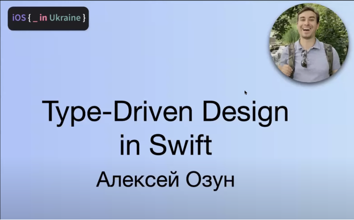

---

# [fit] План

- Проблема
- Теория по функциональному программированию
- Тестирование
- Паттерны фп. Decisions / Executor
- Функциональное ядро и императивная оболочка
- Пример на MVVM с тестами

---

# Проблема

---

# MVVM

```swift
enum Event { case didTapButton }

enum State: Equatable {
    case loading
    case loaded(String)
}

struct Deps {
    let showSnackbar: (String) -> Void
    let loadFact: () async throws -> Fact
}

func handle(_ event: Event) {}
```

---

# MVVM

[.code-highlight: all]
[.code-highlight: 2]
[.code-highlight: 3]
[.code-highlight: 5]
[.code-highlight: all]

```swift
func handle(_ event: Event) {
    state = .loading
    Task {
        do {
            let fact = try await deps.loadFact()
            state = .loaded(fact.text)
        } catch {
            deps.showSnackbar("Went wrong")
        }
    }
}
```

---

# MVVM тесты. Проблемы

[.code-highlight: all]
[.code-highlight: 1, 12]
[.code-highlight: 10, 13]
[.code-highlight: 5]
[.code-highlight: 2-7]
[.code-highlight: all]

```swift
let expectation = expectation(description: "fact loading")
let viewModel = SystemViewModel(
    deps: .init(
        //...
        loadFact: { Fact(text: "some funny fact") }
    )
)

viewModel.handle(.didTapButton)
XCTAssertEqual(viewModel.state, .loading)

wait(for: [expectation])
XCTAssertEqual(viewModel.state, .loaded("some funny fact"))
```

---

# [fit] ООП

---

# ООП

Объекты из реального мира.

Классы, наследование, инкапсуляция, полиморфизм.

Поведение принадлежит объекту.

```swift
class Athlete {
    var trainingHours: Float
    func train(_ hours: Float) { trainingHours += hours }
}
```

---

# [fit] ФП

---

# ФП

```swift
struct Athlete {
    let trainingHours: Float
}

func train(
    athlete: Athlete,
    hours: Float
) -> Athlete {
    Athlete(trainingHours: athlete.trainingHours + hours)
}
```

---

# ФП

## Данные

Entity, Value Object, struct, data class

```swift
struct Athlete {
    let trainingHours: Float
    var hasTrainedEnoughForOlympics: Bool { trainingHours > 1000 }
}
```

---

# ФП

## Функции

- Поведение
- Бизнес логика

^ Поведение! Можно композировать, передавать в другие функции

---

# ФП

## Эффекты

- Общение с внешним миром
- Мутации
- Интерфейс пользователя

^ Без эффектов нельзя

---

# Функции


[.column]
🫧 **Pure** functions

1. Детерминированы
2. Без сайд-эффектов
3. (Изолированы)

[.column]
🤡 **Impure** functions

---

# Чистые функции

```swift
func sum(_ one: Int, _ two: Int) -> Int {
    one + two
}
```

1. Детерминирована
2. Без сайд-эффектов
3. (Изолирована)

---

# Общение между функциями

[.column]

```swift
func pure() {
    pure()
    impure() // 🛑
}
```

[.column]

```swift
func impure() {
    pure()
    impure()
}
```

---

# Больше чистых функций

1. Изолированы
2. Легко тестировать
3. Ожидаемо ведут себя

^ 1. Знают о внешнем мире только то, что у них в аргументах и декларации
^ 2. Вызов приводит входные данные к результату. Больше ничего.
^ 3. Можно быть уверенным, что не повлияют на всю систему

---

# Стремимся

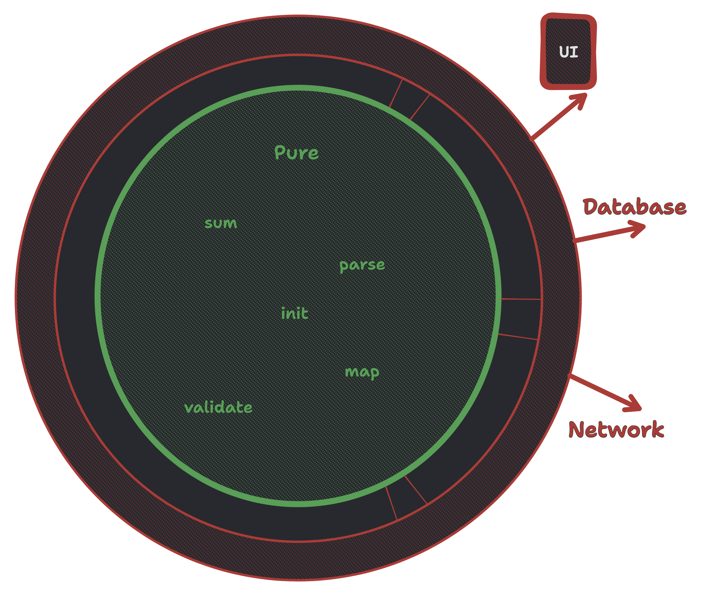

---

# Получаем

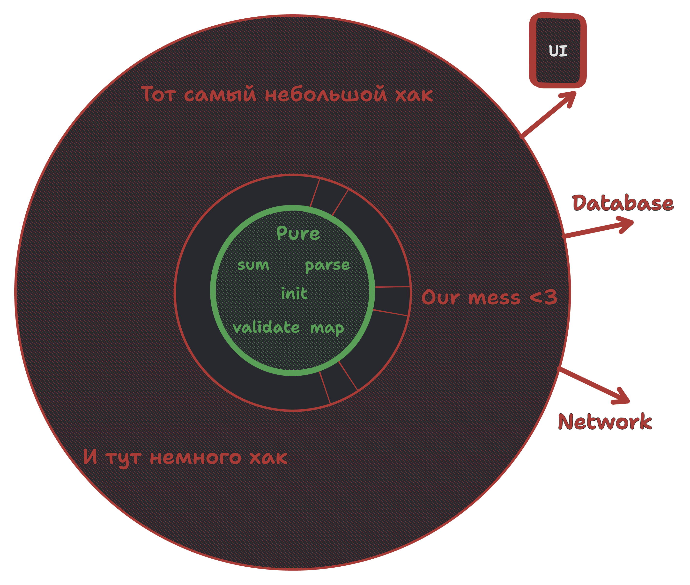

---

# Тесты

---

# Тесты

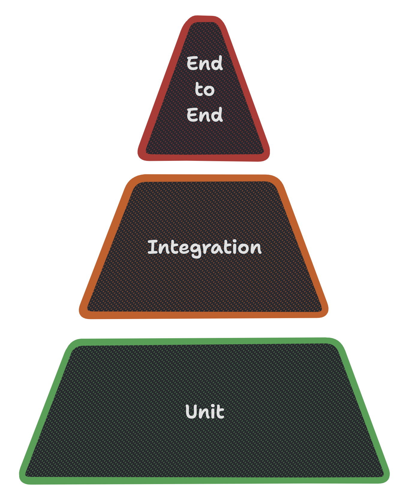

---

# Юниты и интеграционные

```swift
func test_unit() {
    let actual = 2 + 2
    XCTAssertEqual(actual, 4)
}

func test_integration() {
    service.mockedResult = "Mocked"
    ViewModel(service).runLogic()
    XCTAssertEqual(viewModel.state, "Mocked")
}
```

---

## Интеграционные тесты

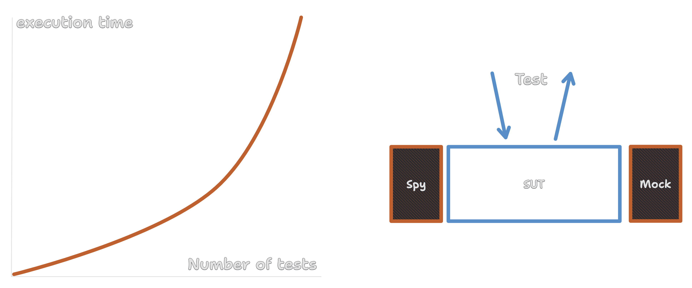

---

Integration tests are a scam

📹 **J.B. Rainsberger -> Boundaries, Gary Bernhardt**

---

# Юнит тесты

- Быстрые
- Изолированные
- Надежные
- Описательные

---

# Тесты

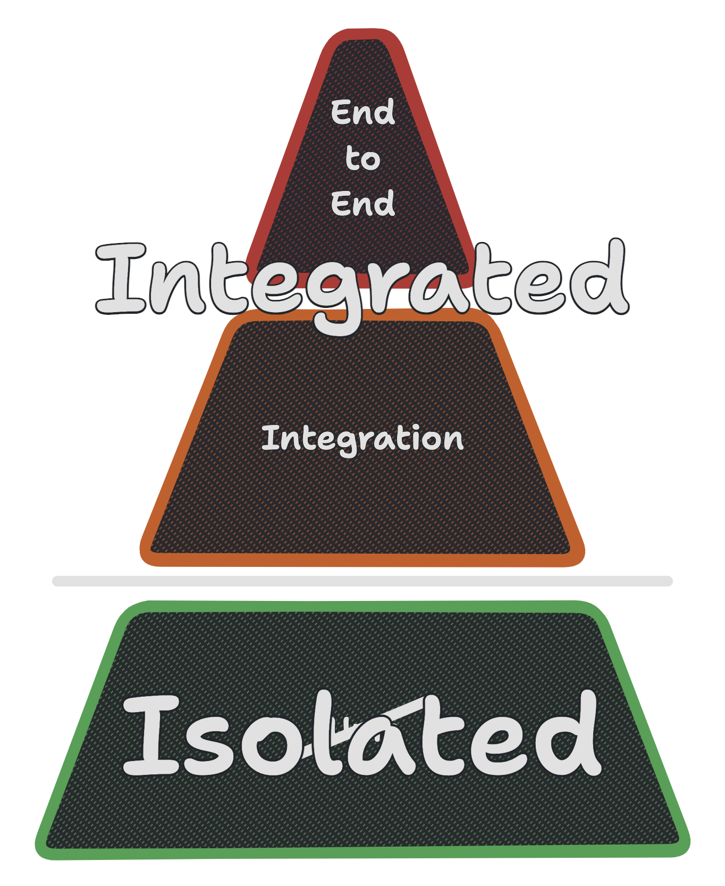

---

# [fit] ФП паттерны

---

# Паттерны

[.column]

- SOLID
- Factory
- Strategy
- Decorator
- Command

---

# Паттерны

[.column]

- SOLID
- Factory
- Strategy
- Decorator
- Command

[.column]

- Functions
- Functions?
- Functions!
- ...
- you know

---

# Принципы дизайна в ФП

- Функции, типы, композиция
- Функции как параметры и интерфейсы
- Частичное применение и Dependency injection
- Pipe, chaining

---

ФП паттерны и дизайн. Монады? Видео, доклады по F#.

📹 **Scott Wlaschin**

---

## **Decisions**<br/>&<br/>**Executor**

---

# Decisions & Executor

^ Есть паттерн функций, который называется по разному

```swift
func makeDecision(input: T) -> Decision?
func makeDecisions(input: T) -> [Decision]
// &
func execute(decision: Decision) {}
```

---

# Decisions & Executor

[.code-highlight: all]
[.code-highlight: 1-2]
[.code-highlight: 4-7]
[.code-highlight: 9]
[.code-highlight: all]

```swift
enum Event { case didTapButton }
enum Decision { case showSnackbar }

enum State { case loading, failed }

func decision(event: Event, state: State) -> Decision? { // 🫧 pure
    if event == .didTapButton {
        switch state {
            case .failed: return .showSnackbar("Everything went wrong")
            case .loading: return nil
        }
    }
}
```

---

# Decisions & Executor

[.code-highlight: all]
[.code-highlight: 1]
[.code-highlight: 2]
[.code-highlight: 5]
[.code-highlight: all]

```swift
func execute(event: Event) { // 🤡 impure
    let decision = decision(event: Event, state: self.state)
    switch decision {
        case .showSnackbar: deps.showSnackbar($0)
        case nil: break
    }
}
```

---

### **Decision** == Action == Command == Intent<br/>&<br/>**Executor** == Performer == Handler

---

# [fit] Functional **Core**<br/>Imperative **Shell**

---

# До

[.code-highlight: all]
[.code-highlight: 1]
[.code-highlight: 2]
[.code-highlight: 4]
[.code-highlight: all]

```swift
func sendToOlympics() async {
    let athletes = await Database.athletes()
    for athlete in athletes {
        if athlete.trainingHours > 1000 && !athlete.isInjured {
            await Aviasales.buyCheapTickets(athlete)
        }
    }
}
```

---

# Core & Shell

[.code-highlight: all]
[.code-highlight: 1]
[.code-highlight: 7]
[.code-highlight: all]

```swift
// 🐚 Shell
func sendToOlympics() async {
    for athlete in filterPrepared(await Database.athletes()) {
        await Aviasales.buyCheapTickets(athlete)
    }
}

// 🤯 Core
func filterPrepared(_ athletes: [Athlete]) -> [PreparedAthlete] {
    athletes.compactMap { try? PreparedAthlete($0) }
}
```

---

# Core & Shell

[.column]

🤯 **Core**

- Мало зависимостей
- Много веток
- Изолирован

[.column]

🐚 **Shell**

- Много зависимостей
- Мало веток
- Интегрирован во внешний мир

---

```swift
struct PreparedAthlete {
    let trainingHours: Float

    init(_ athlete: Athlete) throws {
        if athlete.isInjured { throw AthleteError.injured }
        if athlete.trainingHours < 1000 { throw AthleteError.untrained }
    }
}
```

---

# Parse, don't validate

- Данные, которые уберут невозможное состояние
- Парсинг как можно раньше

`Result<Success, Err> -> Validated<Success, [Err]>`

---

Parse, don't validate

📄 **Alexis King**

---

# Тесты

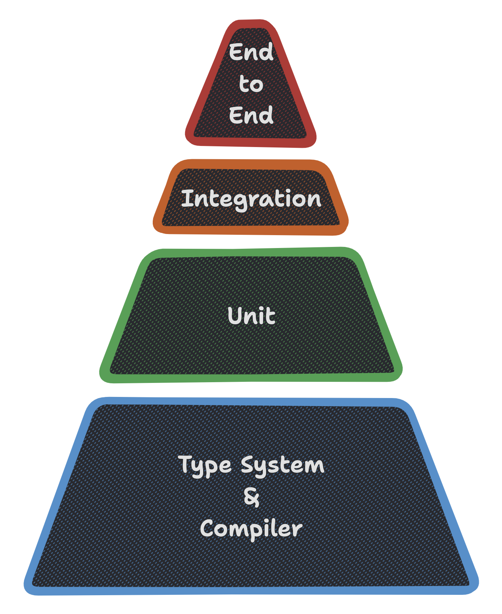

---

# FCIS в<br />приложении

---

# MVVM

```swift
enum Event { case didTapButton }

enum State: Equatable {
    case loading
    case loaded(String)
}

struct Deps {
    let track: (Event) -> Void
    let showSnackbar: (String) -> Void
    let log: (Any...) -> ()
    let loadFact: () async throws -> Fact
}

func handle(_ event: Event) {}
```

---

# MVVM

```swift
func handle(_ event: Event) {
    state = .loading
    deps.track(event)
    Task {
        do {
            let fact = try await deps.loadFact()
            deps.log(fact)
            state = .loaded(fact.text)
        } catch {
            deps.log(error)
            deps.showSnackbar("Went wrong")
        }
    }
}
```

---

# MVVM тесты

```swift
let expectation = expectation(description: "fact loading")
let viewModel = SystemViewModel(
    deps: .init(
        //...
        loadFact: { Fact(text: "some funny fact") }
    )
)

viewModel.handle(.didTapButton)
XCTAssertEqual(viewModel.state, .loading)

wait(for: [expectation])
XCTAssertEqual(viewModel.state, .loaded("some funny fact"))
```

---

# FCIS

```swift
// Before, impure
func handle(_ event: Event) {
    state = .loading
    deps.track(event)
    Task {
        do {
            let fact = try await deps.loadFact()
            deps.log(fact)
            state = .loaded(fact.text)
        } catch {
            deps.log(error)
            deps.showSnackbar("Went wrong")
        }
    }
}
```

---

# FCIS

[.code-highlight: all]
[.code-highlight: 3]
[.code-highlight: 9]
[.code-highlight: all]

```swift
// After, still impure
func handle(_ event: Event) {
    let decisions = Self.makeDecisions(event, &state)
    decisions.forEach {
        switch $0 {
            case .load: Task {
                do {
                    let fact = try await deps.loadFact()
                    handle(.model(.finishLoading(fact)))
                } catch {
                    handle(.model(.failedLoading(error.localizedDescription)))
                }
            }
            case .log(let something): deps.log(something)
            case .track(let event): deps.track(event)
            case .showSnackbar(let message): deps.showSnackbar(message)
        }
    }
}
```

---

# FCIS

```swift
enum Core {
    static func makeDecisions(
        event: Event,
        state: State
    ) -> (State, [Decision]) {
        switch event {
            case .view(.didTapButton):
                return (.loading, [.track(event), .load])
            case .model(.failedLoading(let error)):
                return (state, [.log(error), .showSnackbar("Went wrong")])
            case .model(.finishLoading(let fact)):
                return (.loaded(fact.text), [.log(fact.text)])
        }
    }
}
```

---

# FCIS

```swift
enum Core {
    static func makeDecisions(
        event: Event,
        state: inout State
    ) -> [Decision] {
        switch event {
            case .view(.didTapButton):
                state = .loading
                return [.track(event), .load]
            case .model(.failedLoading(let error)):
                return [.log(error), .showSnackbar("Went wrong")]
            case .model(.finishLoading(let fact)):
                state = .loaded(fact.text)
                return [.log(fact.text)]
        }
    }
}
```

---

# FCIS

[.column]

```swift
enum Event: Hashable {
    enum ViewEvent: Hashable {
        case didTapButton
    }

    enum ViewModelEvent: Hashable {
        case finishLoading(Fact)
        case failedLoading(String)
    }

    case view(ViewEvent)
    case model(ViewModelEvent)
}
```

[.column]

```swift
enum Decision: Hashable {
    case load
    case track(Event)
    case log(String)
    case showSnackbar(String)
}
```

---

# Тестирование и FCIS

```swift

func test_effects_onTap_startsLoading() async throws {
    var state = State.initial
    let decisions = FcisVM.makeDecisions(.view(.didTapButton), &state)

    XCTAssertEqual(state, .loading)
    XCTAssertTrue(decisions.contains(.load))  // Isolated assert only on one function of our system
}

func test_effects_onFinishLoading_setsFact() async throws {
    var state = State.loading
    let decisions = FcisVM.makeDecisions(.model(.finishLoading(Fact(text: "some fact"))), &state)

    XCTAssertEqual(state, .loaded("some fact"))
    XCTAssertEqual(decisions, [.log("some fact")]) // Complete match
}
```

---

# Как разделить на Core & Shell

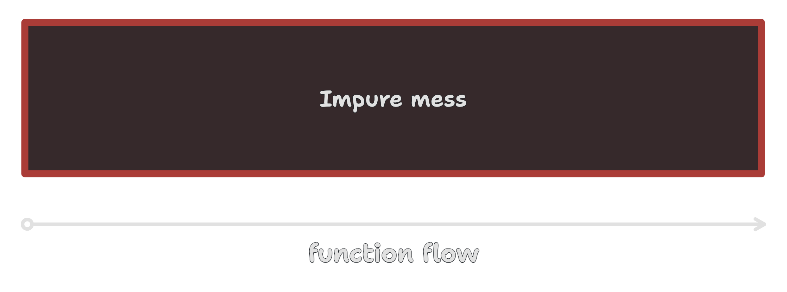

---

# Как разделить на Core & Shell

1. Выделяем чистые функции с поведением, которое можно протестировать

---

# Как разделить на Core & Shell

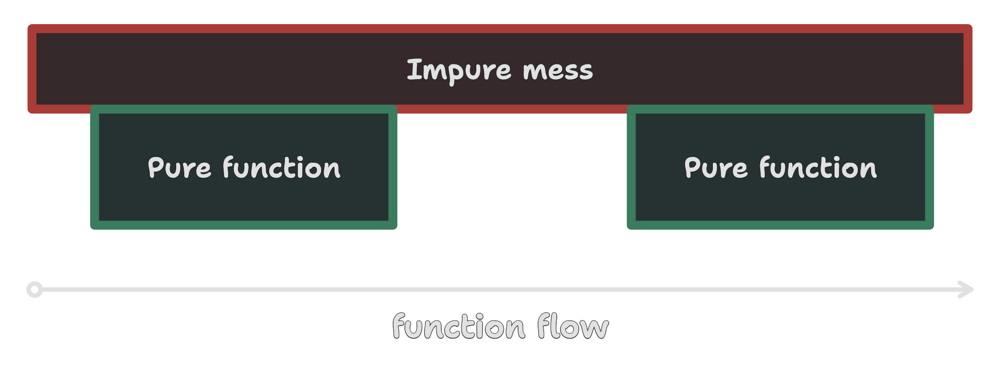

---

# Как разделить на Core & Shell

1. Выделяем чистые функции с поведением, которое можно протестировать
2. Используем паттерн Decision Producer / Executor и связываем

---

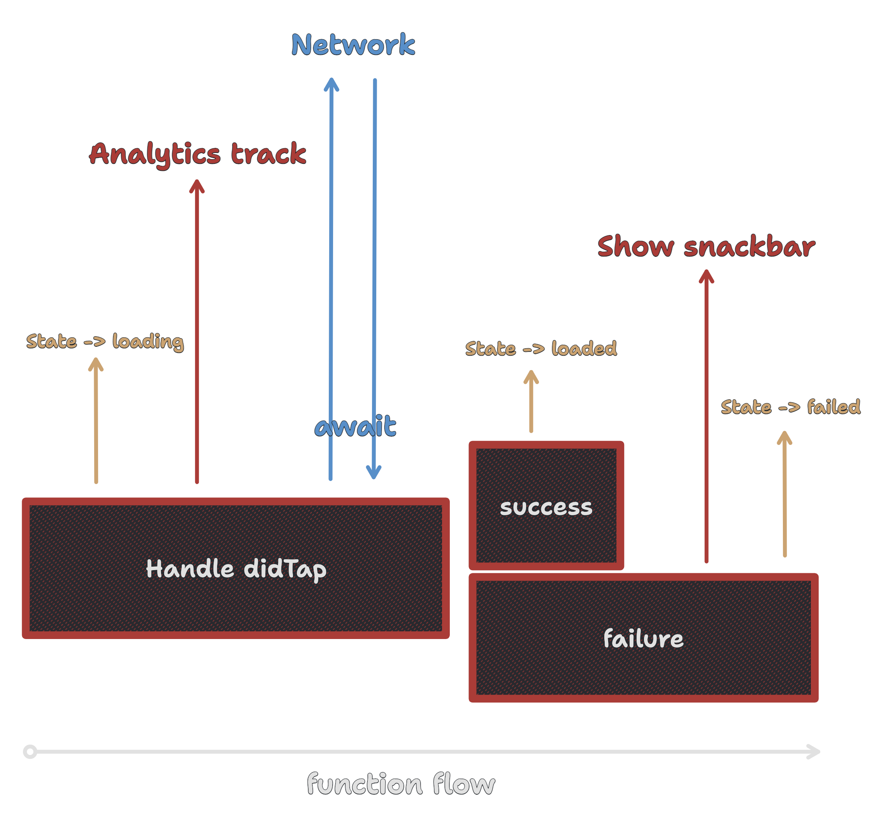

---


---


---

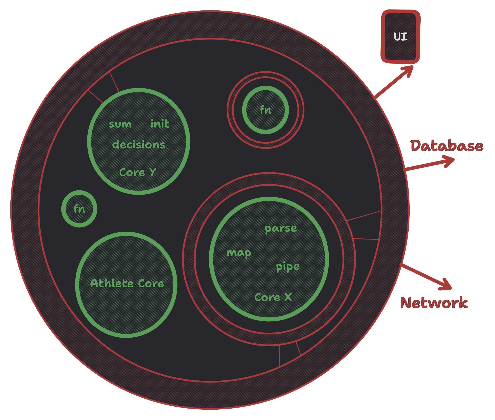

---

# Как тестировать в парадигме FCIS

Юнит тесты на **ядро**

Интеграционные:

1. Немного. Мало веток, много связей.
2. Не тестировать 🐚 Shell.

---

# _Спасибо_

---

# [fit] iOS разработчик из<br/>✈️ Аааааавиасейлс ✈️

### **github.com/AgapovOne**


---

# [fit] Зависимости

---

# Зависимости через протоколы

```swift
protocol CartRepository {
    func items() -> [Item]
}

class DefaultCartRepository: CartRepository {
    func items() -> [Item] { } // from DB
}

class MockCartRepository: CartRepository {
    func items() -> [Item] {} // fake
}
```

---

# Зависимости и использование

```swift
func test_x() {
    let repo: CartRepository
    repo = MockCartRepository(items: [])
    assert(repo.items() == [])
}

// ViewModel
let repo: CartRepository = DefaultCartRepository()
func load() {
    repo.items()
}
```

---

# Функции

---

# Зависимости на функциях

```swift
struct Deps {
    var track: (Event) -> Void
    var showSnackbar: (String) -> Void
    var log: (Any...) -> Void
    var loadFact: () async throws -> Fact
}
```

---

# Зависимости и их подмена

```swift
// Global? Module? Class?
var deps = Deps(
    track: { event in AnalyticsService.shared.track(event) },
    showSnackbar: { AlertManager.show($0) },
    log: { print($0) },
    getCartItems: { try await Network.cartItems() }
)

// in test:
deps.getCartItems = { [] }
```

---

# Зависимости в локальных функциях

```swift
// Dependency for one method
func load(getCartItems: () async throws -> [Item]) {
    try await getCartItems()
}
```

---

# Зависимости

How to Control the World
📄 **Pointfree**

Take control of your dependencies
📹 **Brandon Williams (youtube)**
